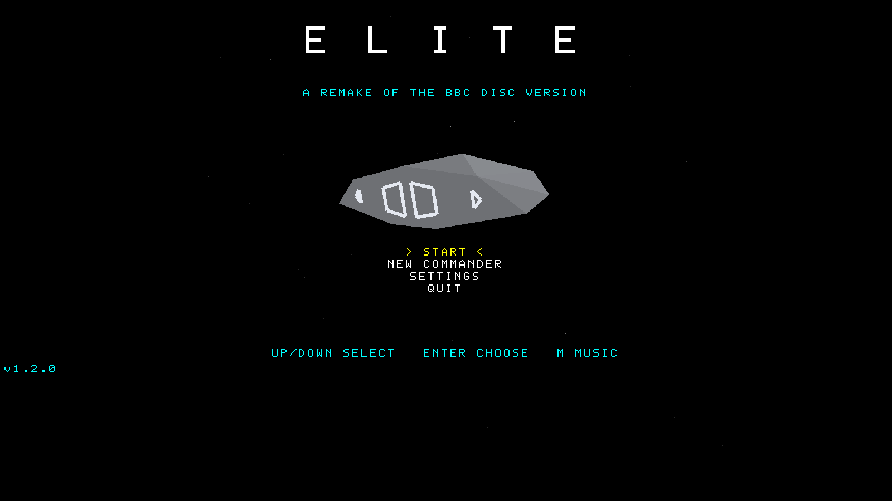
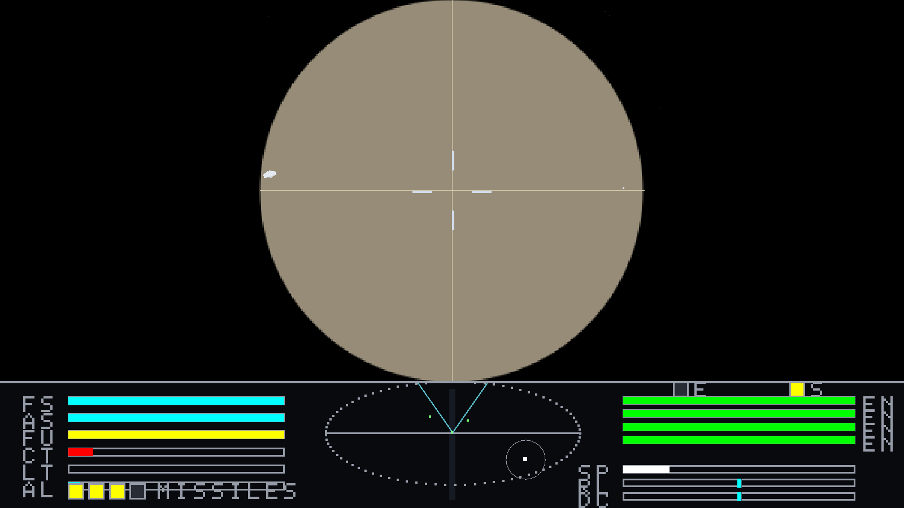
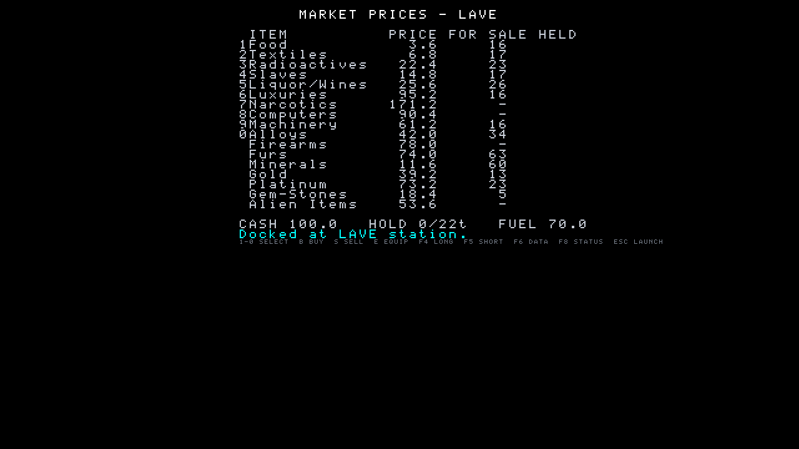
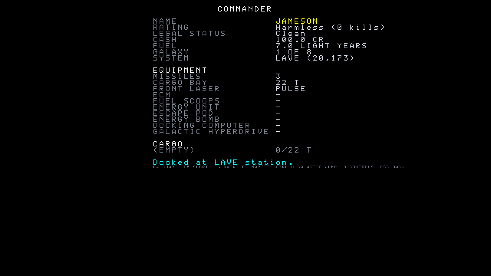

# Elite Remake

**BBC Micro disc Elite, rebuilt from its own 6502 sources in C# on .NET 10 with MonoGame.**

Not a reimagining and not a clone from memory: the universe, the flight model, the ship blueprints,
the text and the trading tables in this repository are extracted from the published assembly sources
of the BBC Micro disc version, and the code is a port of the original's routines — fixed-point maths,
carry-flag quirks and all.



```
dotnet run --project src/EliteRemake.Game
```

---

## Contents

- [What this is](#what-this-is)
- [Screens](#screens)
- [Status](#status)
- [Quick start](#quick-start)
- [Controls](#controls)
- [Command line options](#command-line-options)
- [How it is built](#how-it-is-built)
- [The data pipeline](#the-data-pipeline)
- [Fidelity, and how it is checked](#fidelity-and-how-it-is-checked)
- [Verifying a build](#verifying-a-build)
- [Versioning and releases](#versioning-and-releases)
- [Documentation](#documentation)
- [Licence and credits](#licence-and-credits)

---

## What this is

Elite was written by Ian Bell and David Braben and released by Acornsoft in 1984. The BBC Micro disc
version is the one with the missions, the extended system descriptions, the galactic hyperdrive and
the Thargoids, and it is the version this remake is a port of.

What "port" means here, concretely:

| | |
|---|---|
| **The universe** | All 8 galaxies × 256 systems generated by the original's own twist routine from the original's seeds. Lave is at (20, 173) and is a Rich Agricultural dictatorship because that is what the arithmetic gives. |
| **The flight model** | `MVS4`, `MVS5`, `MVEIT`, `TIDY`, `TACTICS`, `MULT1`/`MLTU2` and the rest, in the original's fixed-point units, at the disc version's own measured rate of **12.5 iterations a second** — with the display interpolating between iterations, because the original's 50 Hz video interrupt only drives the clock, the laser counter and the stardust. |
| **The ships** | All 31 blueprints extracted from the original's binaries and **verified byte-for-byte** against them: 17 ship sets, 527 `XX21` slots, 204 blueprints, 0 mismatches. |
| **The text** | The original's two token systems: the extended token printer (`DETOK`, jump tokens 1–32, the `MTIN` random runs, the two-letter tables) and the standard token table. System descriptions and the mission briefings print the original's words with the original's case rules. |
| **The sound** | The original's beeper effects synthesized from its own sound-chip parameters — channel, amplitude, pitch, duration and the four envelopes the game's loader sets up. |
| **The picture** | The original's blueprint geometry drawn as flat-shaded solids, with the original's face normals deciding which faces are visible, so the silhouettes match the original's hidden-line output. Widescreen, with the original's vertical field of view kept so that ship sizes and combat ranges feel the same. |

Two deliberate departures, both listed with the rest in [`docs/DIVERGENCES.md`](docs/DIVERGENCES.md):
the **Blue Danube** plays on the title screen (the BBC disc has no music at all — that waltz is the
Commodore 64 version's), and **save files are JSON** rather than the original's 76-byte checksummed
block.

## Screens

| Flight | Market |
|---|---|
|  |  |

| Commander status |
|---|
|  |

## Status

**v1.0.0** — the whole loop is playable end to end: launch, fly, fight, trade, jump, dock, take
missions, die. What is left is the long tail, and it is listed rather than hidden.

| Area | State |
|---|---|
| Data pipeline (blueprints, tokens, galaxy, market, equipment) | complete, blueprints byte-verified |
| Universe, galaxy and system generation | complete |
| Flight, views, dashboard, scanner | complete |
| Combat: lasers, missiles, E.C.M., energy bomb, escape pod, bounties, legal status | complete |
| Ship AI, spawning, asteroids and scooping | complete |
| Docking, launching, the docking computer | complete |
| Docked screens: market, equipment, charts, data, status, save/load | complete |
| Hyperspace, galactic hyperdrive, witchspace and Thargoids | complete |
| Missions: offer rules, hints, briefings and debriefings **as text** | complete |
| Missions: the briefing *screens* (incoming message, rotating ship, key waits) | text and the actions they ask for are done; the game layer does not stage them yet |
| Rendering: close-ship detail edges, authentic dial geometry | not yet |
| Death sequence, some rare-state behaviour | not yet |
| Audio | flight effects and title music; the full sound table has not been audited |

A measured way to read that table: the disc version consists of **447 distinct subroutines**; 161 of
them are named in this repository. That is a lower bound rather than a coverage figure — many of the
rest are 6502 drawing primitives, text helpers or main-loop slices whose behaviour exists here under
modern names — but it is the honest shape of the remaining work. Turning it into a real number is the
next piece of work: a coverage table marking every routine *ported*, *equivalent* or *out of scope*.

The engineering log, round by round, with the mistakes and how they were found, is in
[`docs/ROADMAP.md`](docs/ROADMAP.md) (4,800 lines of it).

## Quick start

Requirements:

- **[.NET 10 SDK](https://dotnet.microsoft.com/download)** (built and tested with 10.0.112)
- A GPU with OpenGL 3.0+ — MonoGame DesktopGL, on Windows, Linux or macOS
- Nothing else: the ship data, the token tables and the font are embedded in the assemblies

```bash
git clone https://github.com/tkleisas/elite-remake.git
cd elite-remake

dotnet build EliteRemake.slnx
dotnet test  tests/EliteRemake.Core.Tests        # 412 tests, about 20 seconds
dotnet run --project src/EliteRemake.Game        # play
```

The game starts on the title screen: `START` flies, `NEW COMMANDER` starts from the original's
default commander, `SETTINGS` shows the controls and turns the music off, `QUIT` leaves. A commander
saved with `CTRL-S` while docked is offered on the title screen next time.

## Controls

The original's keys, with two changes: the four views move from the BBC's red function keys `f0`–`f3`
to `F1`–`F4`, because a PC keyboard has no `f0`; and `F10` quits, because the original has no quit key
at all — you reset the machine.

| Flight | | Docked | |
|---|---|---|---|
| `,` `.` | roll left / right | `f1` / `f2` | buy / sell cargo (the market) |
| `X` `S` | pull up / pitch down | `f3` | equipment shop |
| `SPACE` `/` | speed up / slow down | `f4` / `f5` | long / short range chart |
| `A` | fire laser | `f6` | Data on System |
| `T` `M` `U` | lock / fire / unarm missile | `f7` | market prices |
| `E` | E.C.M. | `f8` / `f9` | status / inventory |
| `TAB` | energy bomb | `H` | hyperspace (on the charts) |
| `C` / `P` | docking computer on / cancel | `CTRL-S` | save the commander |
| `J` | in-system jump | `ESC` | launch |
| `H` | hyperspace | arrow keys | move the chart crosshairs |
| `F1`–`F4` | front, rear, left, right view | | |
| `ESCAPE` | escape pod (in flight), quit (docked) | | |
| `F10` | quit, from anywhere | | |

A gamepad works in flight as well: the left stick steers, the triggers are the throttle, and the
buttons map to fire, missile lock and fire, E.C.M., the views and the docking computer.

## Command line options

The game takes options that make it testable without a player — this is how the project is verified
and how the screenshots in this README were taken:

```bash
# a screenshot of any screen, with no window interaction at all
dotnet run --project src/EliteRemake.Game -- --screenshot shot.png --frame 120 \
    --width 1280 --height 720 --skip-title --station-distance 6000

# start docked on a particular screen, fully equipped, and exit after a while
dotnet run --project src/EliteRemake.Game -- --dock status --fully-equipped --exit-after 60
```

| Option | What it does |
|---|---|
| `--title` / `--skip-title` | start on the title screen (default) or straight in the game |
| `--title-settings` | open the title screen's settings page |
| `--screenshot <file>` / `--frame <n>` | write the frame at `n` to a PNG |
| `--width` / `--height` | window and screenshot size |
| `--exit-after <frames>` | leave after this many frames (the status line is printed on exit) |
| `--dock <market\|equipment\|short\|long\|data\|status\|settings>` | start docked on that screen |
| `--launch` | leave the station on the first frame, as `ESC` does |
| `--station-distance <d>` | put the station `d` units in front of us |
| `--fly-to-planet` | an autopilot flight to the planet, for looking at it |
| `--autopilot` | hand over to the docking computer and let it dock |
| `--in-system-jump <n>` | jump `n` times in system |
| `--view <front\|rear\|left\|right>` | which view to start in |
| `--buy <item>[,<view>]` | buy equipment at the start, for testing a fitted ship |
| `--fully-equipped`, `--empty`, `--new-commander` | starting states |
| `--sim-rate <hz>` | run the simulation faster than real time (used by the smoke tests) |
| `--sim-warmup <n>`, `--hold`, `--stress <n>`, `--jump` | development hooks |
| `--viewer` | the ship viewer: every blueprint, turning, with its statistics |
| `--font-sheet` | print the bitmap font, for checking the glyphs |
| `--help` | the list, from the source rather than from this table |

## How it is built

```
EliteRemake.slnx
├── src/EliteRemake.Core        the simulation: no MonoGame, no window, no I/O — testable on its own
│   ├── Maths                   the original's fixed-point arithmetic (MULT1, MLTU2, TIS2, DVID96 …)
│   ├── Universe                the galaxy generator, system data, the market and equipment tables
│   ├── Ships                   blueprints, meshes, the ship data block and its offsets
│   ├── Sim                     FlightSim, Tactics, ShipMovement, Combat, Missiles, Docking,
│   │                           Missions, GameSession — the rules, on the original's clocks
│   ├── Text                    the token printers
│   ├── Graphics / Audio        geometry helpers; the sound-chip synthesizer
│   └── GameVersion.cs          the version, read back off the assembly
├── src/EliteRemake.Data        the extracted tables, embedded as resources
├── src/EliteRemake.Game        MonoGame: scenes, renderer, dashboard, input, sound, settings
├── tools/EliteDataExtractor    reads the assembly sources and writes data/*.json, then verifies
└── tests/EliteRemake.Core.Tests 412 tests over the simulation and the data
```

The split is deliberate. `EliteRemake.Core` has no dependency on MonoGame, so the simulation can be
stepped a thousand times in a test and asked what happened: that is how the recharge clock, the
station's spin rate, the docking range and the acceleration byte were caught doing the wrong thing.
`EliteRemake.Game` owns everything a player sees and nothing a player is governed by.

The original's own structure is kept where it matters. Each ported routine says which 6502 routine it
came from, and the timetable is the original's: recharge every eighth iteration (`MCNT & 7`), the
planet and sun checks every thirty-second (`MCNT & 31`), spawn decisions every 256th, `TIDY` and
`TACTICS` on `(MCNT ^ slot)` schedules, missiles every iteration.

## The data pipeline

`data/*.json` is generated, not hand-written, and it is committed so the game builds from a clone
with nothing else installed. Regenerating it needs the
[Elite source code library](https://github.com/markmoxon/elite-source-code-library) (the annotated
disassembly this port is written against):

```bash
git clone https://github.com/markmoxon/elite-source-code-library ~/elite-source-code-library

dotnet run --project tools/EliteDataExtractor -- all \
    --source ~/elite-source-code-library     # or set ELITE_SOURCE_LIBRARY
```

`all` extracts the blueprints, the galaxy seeds, the market and equipment tables and the token
tables, and then **verifies the blueprints against the original's own binaries** — 17 ship sets, 527
`XX21` slots, 204 blueprints compared, 0 mismatches. The verifier is the point: extraction that
nobody checks is just a story about a data file.

## Fidelity, and how it is checked

The rules this project works to, learned the hard way and written down so they keep being applied:

1. **Measure, do not read.** The station's spin rate, the iteration rate and the docking range were
   all established by running the original's own schedule and watching the numbers, not by reading a
   comment that turned out to describe a different version.
2. **When a constant is written, find its reader.** An acceleration byte was written by the AI and
   read by nobody for weeks; so was a scooped-item flag and a "missile fired at us" flag.
3. **A check that supplies its own inputs cannot find a fault in the supplier.** The data extractor
   verifies against the original's binaries rather than against its own output.
4. **Check the version guard above a suspicious instruction.** The source library carries ten
   versions of Elite; a line that looks wrong is often another machine's.
5. **The port implements well what it implements and quietly misses whole mechanics.** The way to
   find those is to ask what a loop is *for* — that is how the missions' briefings, the explosion
   clouds and the recharge clock were found doing nothing.

Every deliberate difference from the original is in [`docs/DIVERGENCES.md`](docs/DIVERGENCES.md),
both the faithful quirks reproduced on purpose (the `TIDY` byte that is left alone, the ±1 artefact
in the complement multiplication, the missile-destroyed-beside-us test that needs a 256-unit lattice
point) and the modern choices (widescreen, a title menu, JSON saves).

## Verifying a build

```bash
dotnet test tests/EliteRemake.Core.Tests                    # 412 tests, ~20 s

# the game runs, draws a frame and reports what it did
dotnet run --project src/EliteRemake.Game -- --title --screenshot /tmp/title.png --frame 30
#   -> Final: Title: version 1.0.0, selected START, music on (playing), save absent

# a flight in front of the station, then the docking computer takes us in: --sim-rate runs the
# simulation faster than real time so the whole approach fits in twenty seconds
dotnet run --project src/EliteRemake.Game -- --skip-title --autopilot --station-distance 3000 \
    --sim-rate 250 --exit-after 1200
#   -> Drew 1200 frames in 20.00s: 16.67 ms a frame, 60.0 fps (simulation steps run at 13 Hz, up
#      to 10 a frame)
#   -> Final: Market: LAVE, 17 items, 100.0 credits, 0/22 t held
```

## Versioning and releases

The version lives in one place, `<Version>` in [`Directory.Build.props`](Directory.Build.props), and
[`GameVersion`](src/EliteRemake.Core/GameVersion.cs) reads it back off the assembly, so the title
screen cannot disagree with the build. It is shown at the bottom left of the title screen and in the
status line that the screenshot harness prints.

Releases are git tags `vMAJOR.MINOR.PATCH` with an entry in [`CHANGELOG.md`](CHANGELOG.md). What the
three numbers mean for a faithful port — and why a fidelity fix is a PATCH rather than a feature — is
in [`docs/VERSIONING.md`](docs/VERSIONING.md).

## Documentation

| Document | What is in it |
|---|---|
| [`docs/ROADMAP.md`](docs/ROADMAP.md) | the engineering log by round: what was ported, what was wrong, how it was found |
| [`docs/DIVERGENCES.md`](docs/DIVERGENCES.md) | every deliberate difference from the original, and the quirks reproduced on purpose |
| [`docs/VERSIONING.md`](docs/VERSIONING.md) | the versioning scheme and what a release has to satisfy |
| [`CHANGELOG.md`](CHANGELOG.md) | what changed in each release |

## Licence and credits

The code in this repository is **MIT licensed** — see [`LICENSE`](LICENSE). The notices about Elite
itself, and about the work this was built on, are in [`NOTICE.md`](NOTICE.md).

Elite was written by **Ian Bell** and **David Braben** and is copyright © Acornsoft 1984. This is an
independent remake, not affiliated with or endorsed by them. It ships no original assets: the
geometry, the universe and the text are extracted from the published sources by this repository's own
tool, the artwork is generated at run time, and the sounds are synthesized from the original's own
sound-chip parameters. The annotated disassembly that made the port possible is
[Mark Moxon's Elite source code library](https://github.com/markmoxon/elite-source-code-library), and
the deep dives on [bbcelite.com](https://www.bbcelite.com) were the reference for how the original's
routines behave.
